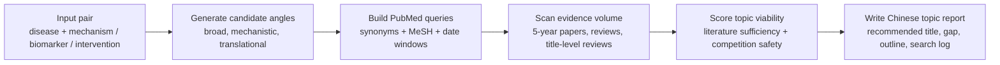

# Medical Review Topic Scout

Find review topics that are **not too empty, not too saturated, and easier to justify with PubMed evidence**.

`medical-review-topic-scout` is a local Codex skill plus a standalone Python scanner for biomedical literature review topic scouting. It turns a rough pair such as `gastric cancer + cancer-associated fibroblasts` into candidate review angles, PubMed search strings, recent-review competition checks, and a Chinese-style topic report.

## What it helps you answer

- Is this review topic already saturated?
- Are there enough recent primary studies to support a manuscript?
- Are there direct competing reviews in the last 2-3 years?
- Which narrower mechanism, biomarker, intervention, omics, or translational angle is more writable?
- What exact PubMed query should be recorded in the topic report?

## Workflow



## Repository contents

| Path | Purpose |
|---|---|
| `SKILL.md` | Codex skill instructions and report workflow |
| `scripts/pubmed_topic_scan.py` | PubMed E-utilities scanner for counts, direct-review checks, query translation capture, scoring, JSON/CSV export, synonym blocks, and MeSH terms |
| `references/report-template.md` | Copyable Chinese topic report template |
| `agents/openai.yaml` | UI metadata for the skill |

## Quick start: run the PubMed scanner

Requirements:

- Python 3.9+
- Internet access to NCBI PubMed E-utilities
- No API key is required for light use

```powershell
git clone https://github.com/sushuqiong/medical-review-topic-scout.git
cd medical-review-topic-scout

python .\scripts\pubmed_topic_scan.py `
  --direction "gut microbiome|Alzheimer disease"
```

Multiple candidate directions can be scanned at once:

```powershell
python .\scripts\pubmed_topic_scan.py `
  --direction "gut microbiome|Alzheimer disease" `
  --direction "tau/phosphorylated tau|gut microbiome/gut microbiota|Alzheimer disease/Alzheimer's disease" `
  --csv topic_scan.csv
```

The script reports:

- total PubMed hits in the last 5 years
- all review hits
- recent 3-year review hits
- stricter title-level recent review hits
- a rough viability score
- PubMed `QueryTranslation`
- sample recent/direct reviews and latest papers

## Use as a Codex skill

Clone or copy this repository into your local Codex skills directory, then invoke:

```text
Use $medical-review-topic-scout 我想写一篇 胃癌 和 肿瘤相关成纤维细胞 相关的综述，帮我找个文献量够、直接竞争少的选题。
```

Example tasks:

```text
Use $medical-review-topic-scout 帮我评估“结直肠癌 + ferroptosis”是否适合写综述，并给出3个更窄的机制方向。
```

```text
Use $medical-review-topic-scout 我想写“糖尿病肾病 + 单细胞测序”方向，请帮我查PubMed竞争综述并生成选题报告。
```

## How directions are written

Use `|` to separate concept blocks and `/` to separate synonyms inside a block.

```text
disease synonym 1/disease synonym 2/mesh:MeSH Term|mechanism synonym 1/mechanism synonym 2
```

Examples:

```text
gastric cancer/stomach neoplasms/mesh:Stomach Neoplasms|cancer-associated fibroblasts/CAF
```

```text
diabetic kidney disease/diabetic nephropathy/mesh:Diabetic Nephropathies|single-cell RNA sequencing/scRNA-seq
```

## Saturation labels

| Label | Meaning |
|---|---|
| `严重饱和` | Multiple title-level recent direct reviews; usually avoid unless doing a clear update |
| `饱和` | Many papers plus many recent reviews; differentiation is difficult |
| `近期有综述` | A nearby review exists recently; scope needs careful repositioning |
| `刚被占/需差异化` | One recent direct review appears; possible but risky |
| `有空间` | Enough evidence and limited direct review competition |
| `空白/有空间` | No direct reviews and enough recent literature to support writing |
| `略窄` | Literature volume may be too small unless adjacent evidence is strong |

## Example output

```text
| Direction | 5-year count | Reviews all | Reviews recent 3y | Title-review recent 3y | Score | Label |
|---|---:|---:|---:|---:|---:|---|
| gut microbiome/gut microbiota/... x Alzheimer disease/... | ... | ... | ... | ... | ... | ... |

## gut microbiome/gut microbiota/... x Alzheimer disease/...
- 5-year query: `...`
- Review query: `...`
- PubMed query translation: `...`
- Recent/direct review samples:
  - PMID ...: ...
```

## Recommended report structure

The skill writes the final answer in Chinese by default:

1. Topic landscape table
2. Recommended title
3. Evidence volume support
4. Direct-review competition check
5. Novelty and differentiation statement
6. Suggested manuscript outline
7. PubMed search log
8. Backup directions
9. Risks and next steps

## Notes for medical research use

- PubMed counts are search-dependent and should be treated as reproducible scouting evidence, not final proof of novelty.
- For formal manuscript planning, verify important topics in Web of Science, Scopus, Embase, or another database available to your institution.
- Do not claim a topic has “never been written” unless reproducible searches support that conclusion.
- Avoid entering patient identifiers or protected health information into search prompts.
- This project supports literature topic selection and does not provide clinical diagnosis or treatment advice.

## Keywords

`PubMed` · `biomedical literature` · `review topic scouting` · `evidence synthesis` · `medical research` · `systematic review` · `AI for science`
